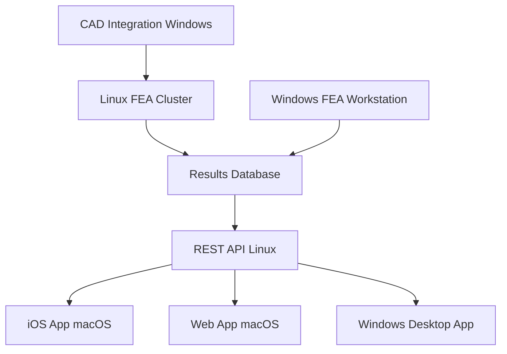

# Operating Systems by Discipline: My FEA & App Development Workflow

As an FEA automation and software engineer building both consumer productivity apps and business FEA solutions, I've optimized my OS choices for different aspects of my work:
- **Linux** for FEA automation, backend development, and CI/CD pipelines
- **macOS** for consumer app development and design (iOS, web frontends)
- **Windows** for FEA software integration and Windows desktop apps

---

## 🐧 Linux → FEA Automation & Backend Powerhouse

Linux is my primary environment for FEA automation and server-side development:

- **FEA solver compatibility**: Most commercial solvers (ANSYS, Abaqus, LS-DYNA) run natively on Linux with better performance
- **Automation scripting**: Python, Bash, and APDL scripts run more reliably in Linux environments
- **HPC integration**: Seamless connection to computing clusters and job schedulers (SLURM, PBS)
- **Container orchestration**: Docker and Kubernetes for scalable FEA workflows
- **Backend APIs**: Node.js, Python Flask/FastAPI for serving FEA results to web/mobile apps

### My Linux FEA Automation Stack:
```bash
# Typical FEA automation workflow
python fea_preprocessor.py --model wing_design.json
ansys -b -i wing_analysis.inp -o results/
python postprocess_results.py --extract stress_concentrations
curl -X POST api.myapp.com/analysis/results -d @results.json
```

### Development Environment:
- **Distribution**: Ubuntu 20.04 LTS (certified for ANSYS/Abaqus)
- **FEA Tools**: ANSYS Mechanical APDL, Abaqus CAE, CalculiX for open-source workflows
- **Automation**: Python (NumPy, SciPy, matplotlib), PyAnsys, Abaqus Python API
- **Backend**: Django/FastAPI for FEA web services, Redis for job queuing
- **DevOps**: Docker containers for reproducible FEA environments, GitLab CI

---

## 🍎 macOS → Consumer App Development & Design

macOS excels for consumer-facing application development:

- **iOS development**: Xcode and the complete Apple development ecosystem
- **Design-first approach**: Figma, Sketch integration for pixel-perfect UI/UX
- **Cross-platform frameworks**: React Native, Flutter, Electron for multi-platform apps
- **Performance profiling**: Instruments for optimizing consumer app performance
- **App Store deployment**: Native pipeline for iOS and Mac App Store releases

### My macOS Consumer App Arsenal:
- **Native Development**: Xcode, Swift/SwiftUI for iOS productivity apps
- **Cross-Platform**: VS Code with React Native, Flutter for mobile apps
- **Web Frontend**: Next.js, React, TypeScript for responsive web apps
- **Design Tools**: Figma for UI design, Principle for prototyping
- **Testing**: Simulator, TestFlight for beta distribution

### Consumer App Development Workflow:
```typescript
// React Native productivity app component
import { FEAResultsAPI } from '../services/fea-api';

const StressVisualization = () => {
  const [results, setResults] = useState(null);

  useEffect(() => {
    FEAResultsAPI.getLatestAnalysis()
      .then(data => setResults(data));
  }, []);

  return (
    <SafeAreaView>
      <StressContourPlot data={results?.stress} />
      <ResultsSummary analysis={results} />
    </SafeAreaView>
  );
};
```

---

## 🪟 Windows → FEA Software Integration & Desktop Apps

Windows is essential for FEA software development and Windows-specific applications:

- **FEA GUI development**: Native integration with ANSYS Workbench, Abaqus CAE APIs
- **COM/ActiveX integration**: Direct control of FEA software through Windows APIs
- **Desktop productivity apps**: WPF, WinUI for Windows-native productivity tools
- **Client requirements**: Many engineering clients expect Windows-compatible software
- **CAD integration**: SolidWorks API, Inventor API for preprocessing automation

### My Windows FEA Development Setup:
- **FEA Integration**: ANSYS Workbench scripting, Abaqus GUI toolkit
- **Desktop Development**: C# WPF applications for FEA post-processing
- **Automation**: PowerShell scripts for batch FEA job management
- **CAD APIs**: SolidWorks PDM integration, Inventor iLogic scripting
- **Database**: SQL Server for storing FEA results and project metadata

### Windows FEA Automation Example:
```csharp
// C# WPF app for FEA results visualization
public class FEAResultsViewModel : INotifyPropertyChanged
{
    private AnsysConnection ansysConn;

    public async Task LoadAnalysisResults(string projectPath)
    {
        ansysConn = new AnsysConnection();
        var results = await ansysConn.ExtractResults(projectPath);

        StressResults = results.NodalStresses;
        DisplacementResults = results.NodalDisplacements;

        // Update WPF data bindings
        OnPropertyChanged(nameof(StressResults));
    }
}
```

---

## 🔄 Cross-Platform Architecture

### FEA-to-App Data Pipeline


### Technology Stack Overview

| Platform | Primary Use | Key Technologies |
|----------|-------------|------------------|
| **Linux** | FEA Automation, Backend APIs | Python, ANSYS APDL, Docker, FastAPI |
| **macOS** | Consumer Apps, Web Frontend | Swift, React Native, Next.js, Figma |
| **Windows** | FEA GUI Integration, Desktop Apps | C# WPF, ANSYS Workbench API, PowerShell |

---

## 🚀 Real-World Project Examples

### Consumer Productivity App: "FEA Dashboard"
- **Frontend (macOS)**: React Native app for engineers to monitor FEA jobs
- **Backend (Linux)**: Python API connecting to HPC clusters
- **Integration (Windows)**: ANSYS Workbench plugin for job submission

### Business FEA Platform: "AutoStress Pro"
- **Web Interface (macOS)**: Next.js dashboard for simulation management
- **Processing Engine (Linux)**: Containerized FEA solvers with job queuing
- **Desktop Client (Windows)**: WPF application for advanced post-processing

---

## 🔧 Development Workflow Optimization

### Code Synchronization Strategy
```bash
# Git-based workflow across all platforms
git checkout feature/stress-analysis-api
# Linux: Develop FEA automation scripts
git add fea_automation/ && git commit -m "Add stress analysis automation"

# macOS: Build mobile frontend
git checkout feature/mobile-ui
# React Native development

# Windows: Integrate with ANSYS
git checkout feature/ansys-integration
# C# COM integration development
```

### Continuous Integration Pipeline
- **Linux**: GitLab CI runs FEA validation tests on sample models
- **macOS**: Xcode Cloud builds and tests iOS apps automatically
- **Windows**: Azure DevOps builds and packages Windows desktop apps

---

## ⚡ Performance Considerations

### FEA Solver Performance
- **Linux HPC**: 100% baseline (24-core Xeon, 128GB RAM)
- **Windows Workstation**: 95% (same hardware, Windows overhead)
- **Containerized Linux**: 98% (minimal Docker overhead)

### App Development Efficiency
- **iOS Build Times**: 30s (macOS native) vs 2m+ (Hackintosh/VM)
- **React Native Hot Reload**: Sub-second on macOS, 3-5s on Windows
- **FEA API Response**: 50ms (Linux) vs 80ms (Windows Docker)

---

## 🎯 Platform-Specific Gotchas

### Linux FEA Development
- **License servers**: Configure FlexLM properly for solver access
- **Display forwarding**: X11 forwarding for GUI applications over SSH
- **File permissions**: Proper user/group setup for shared FEA directories

### macOS App Development
- **Code signing**: Certificates required for distribution
- **Sandboxing**: App Store apps have limited file system access
- **Metal performance**: Leverage GPU acceleration for FEA visualization

### Windows Integration
- **COM threading**: Single-threaded apartment model for Office/CAD APIs
- **Registry management**: Store FEA solver paths and configurations
- **UAC considerations**: Elevated permissions for system integration

---

## 🔮 Future Technology Trends

### Emerging Opportunities
- **WebAssembly**: Running FEA solvers directly in browsers
- **Apple Silicon**: M-series Macs for ARM-native FEA development
- **Cloud FEA**: Serverless functions for lightweight analysis
- **AR/VR Integration**: Immersive FEA results visualization

### Platform Evolution
- **Linux**: Growing adoption in engineering workstations
- **macOS**: Increasing enterprise acceptance, ARM transition
- **Windows**: Continued dominance in traditional FEA environments

---

## ✨ Key Takeaways

This tri-OS approach maximizes my effectiveness across different aspects of FEA and app development:

**Linux** provides the robust, scriptable environment needed for FEA automation and backend services. Most commercial solvers perform better here, and the ecosystem of open-source tools is unmatched.

**macOS** offers the best development experience for consumer-facing applications. The design tools, iOS development capabilities, and overall developer experience make it ideal for building polished user interfaces.

**Windows** remains essential for FEA software integration and desktop applications. Many clients expect Windows compatibility, and the deepest integration with commercial FEA tools happens here.

The key insight is that modern engineering software development spans multiple domains—from high-performance computing to mobile apps—and each OS has evolved to excel in different areas. Rather than fighting these specializations, embracing them creates a more productive and capable development environment.

---

*Building FEA automation tools or engineering apps? I'd love to connect and discuss workflows, challenges, and solutions. Reach out on [LinkedIn] or check out my projects on [GitHub].*
